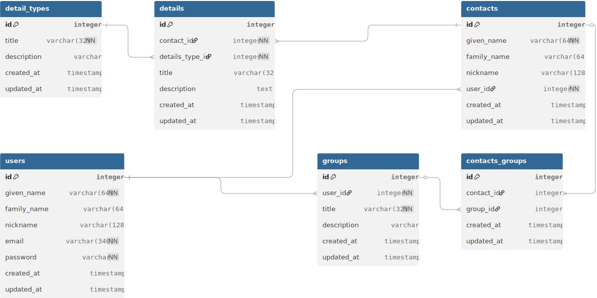

# Contacts API

## Features

- ...

## Requirements

- PHP 8.4+

## Quick Start

## API Documentation

Once running, access the auto-generated documentation:

- **Swagger UI**: [http://localhost:8080/docs/api](http://localhost:8080/docs/api)
- **OpenAPI JSON**: [http://localhost:8080/docs/api.json](http://localhost:8080/docs/api.json)

## Authentication

## Database Structure

Most up to date version of ERD:
[Contact API ERD](https://dbdiagram.io/d/contacts-api-69b37f7e84de9dc380117598)

DBML as of 2026/03/13: [contact-api-erd.dbml](database/contact-api-erd.dbml)

## License

This project is open-sourced software licensed under the [MIT license](LICENSE).

## Credits

- [Laravel](https://laravel.com) - The PHP Framework
- [Laravel Sanctum](https://laravel.com/docs/sanctum) - API Token Authentication
- [grazulex/laravel-apiroute](https://github.com/Grazulex/laravel-apiroute) - API Versioning
- [spatie/laravel-query-builder](https://github.com/spatie/laravel-query-builder) - Query Building
- [spatie/laravel-data](https://github.com/spatie/laravel-data) - Data Transfer Objects
- [dedoc/scramble](https://github.com/dedoc/scramble) - API Documentation
- [grazulex/laravel-api-idempotency](https://github.com/Grazulex/laravel-api-idempotency) - API Idempotency (optional)
- [grazulex/laravel-api-throttle-smart](https://github.com/Grazulex/laravel-api-throttle-smart) - Smart Rate Limiting (optional)
- [Pest PHP](https://pestphp.com) - Testing Framework

## Support

- [Documentation](https://github.com/grazulex/laravel-api-kit/wiki)
- [Issues](https://github.com/grazulex/laravel-api-kit/issues)
- [Discussions](https://github.com/grazulex/laravel-api-kit/discussions)
